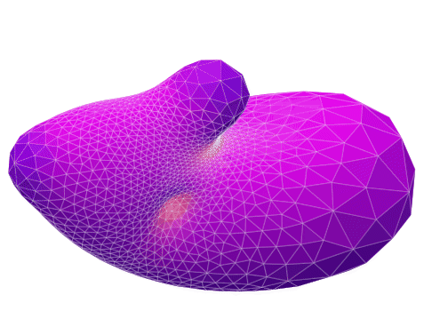
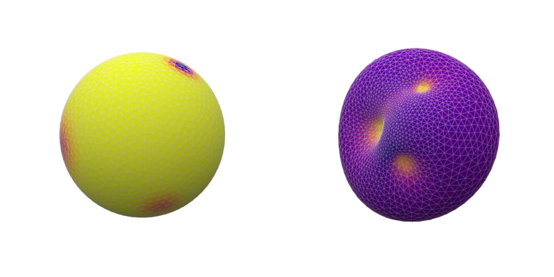

# Basic conformal transformation python module  

The module provides methods to find the nearest conformal transformation for a given mean curvature change.
A curvature flow can be applied such as shown in the script *flow_example.py* .

## References
CRANE, Keenan, PINKALL, Ulrich, and SCHRÖDER, Peter. Spin transformations of discrete surfaces. ACM SCRUFF 2011 papers, 2011, p. 1-10.

CRANE, Keenan, PINKALL, Ulrich, et SCHRÖDER, Peter. Robust fairing via conformal curvature flow. ACM Transactions on Graphics (TOG), 2013, vol. 32, no 4, p. 1-10.

## Requirements
- matplotlib
- networkx
- numba
- numpy
- scipy
- setuptools
- trimesh

        pip install matplotlib networkx numba numpy scipy setuptools trimesh

## Usage
The project use numba cc to compile the modules into a dynamic .so library, 
so before running the scripts for the first time you should compile with the command :
        
        python compile_modules.py

